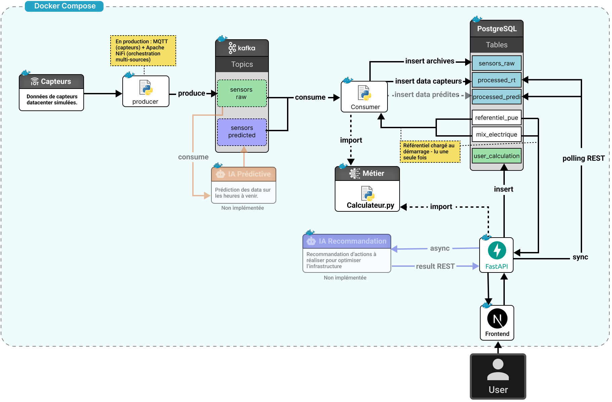

[](https://github.com/AlexandreN8/hackaton/actions/workflows/build.yml)

# i-Cooling - Hackathon Cisco

Comparatif objectivé des technologies de refroidissement datacenter IA (AC, IC, RDHx, DLC) avec données capteurs en temps réel, score composite configurable et recommandation IA.

## Stack

- **Backend** : FastAPI + PostgreSQL
- **Broker** : Kafka + Zookeeper
- **Calcul** : bloc métier Python pur (`calculator.py`) - fonctions pures, zéro I/O
- **Frontend** : React + Vite + Chart.js - dashboard responsive mobile/desktop
- **IA** : score composite multicritères configurable - service recommandation LLM (`/stream-reco`) architecturé, à connecter



## Démarrage

### Dataset

Générer le dataset de simulation (modèle physique réaliste) :

```bash
cd data
python genset_sync.py
# → écrit data/dataset_ia_72h_sync.jsonl (72h à 2s/mesure × 4 racks)
```

Modèle physique :

- `p_it_kw = baseline + P_cpu_max × cpu% + P_gpu_max × gpu%`
- Inertie thermique du 1er ordre par composant et techno (τ_gpu AC=120s, IC=60s)
- Machine à états partagée idle/training - transitions progressives (~4 min idle, ~10 min training)

### Lancer les conteneurs Docker

```bash
cp .env.example .env
docker compose up --build
```

Le service `init` charge automatiquement le référentiel (4 technos, 6 mix électriques) au démarrage.

| Service       | URL                        |
| ------------- | -------------------------- |
| **Dashboard** | http://localhost:8080      |
| **API**       | http://localhost:8000      |
| **Swagger**   | http://localhost:8000/docs |

## Monitoring ( System + Kafka )

| Service              | URL                              | Description                        |
| -------------------- | -------------------------------- | ---------------------------------- |
| **Grafana**          | http://localhost:3000            | Dashboards Kafka, System (admin/admin) |
| **Prometheus**       | http://localhost:9090            | Time-series database & metrics     |
| **Kafka Exporter**   | http://localhost:9308/metrics    | Kafka broker metrics endpoint      |        |
| **Node Exporter**    | http://localhost:9100/metrics    | System metrics (CPU, RAM, disk)    |

### Dashboards Grafana

- **Kafka Broker Monitoring** - Brokers, partitions, ISR, replicas, under-replicated
- **System Dashboard** - CPU, RAM, network, disk monitoring

## Endpoints

### Temps réel (données capteurs Kafka)

| Route             | Description                                                                          |
| ----------------- | ------------------------------------------------------------------------------------ |
| `GET /rt/latest`  | Dernière mesure par rack - capteurs bruts + métriques calculées                      |
| `GET /rt/history` | Série temporelle - params : `window=30m\|1h\|24h`, `technos=AC`, `mix_scenarios=...` |

### Simulateur (mode what-if)

| Route               | Description                                                                            |
| ------------------- | -------------------------------------------------------------------------------------- |
| `POST /calculate`   | Calcul comparatif - body : `{"p_it_kw": 50, "technos": ["AC","IC"], "prix_kwh": 0.15}` |
| `GET /history`      | N derniers calculs utilisateur                                                         |
| `POST /stream-reco` | Recommandation IA streaming SSE                                                        |

### Référentiel et utilitaires

| Route              | Description                |
| ------------------ | -------------------------- |
| `GET /referentiel` | Technos et mix disponibles |
| `GET /health`      | Healthcheck                |
| `GET /docs`        | Swagger                    |

## Topics Kafka

| Topic               | Producteur                                 | Consommateur                       |
| ------------------- | ------------------------------------------ | ---------------------------------- |
| `sensors.raw`       | `producer` (dataset simulé)                | `consumer` → `processed_rt`        |
| `sensors.predicted` | service IA prédictive _(extension prévue)_ | `consumer` → `processed_predicted` |

## Payload capteur (`sensors.raw`)

```json
{
  "timestamp": "2026-03-20T11:40:15Z",
  "rack_id": "Rack-01-AC",
  "techno": "AC",
  "p_it_kw": 12.88,
  "cpu_usage_percent": 7.2,
  "cpu_temp_c": 44.0,
  "ddr_temp_c": 25.3,
  "psu_temp_c": 42.2,
  "gpu_usage_percent": 1.8,
  "gpu_temp_c": 54.6,
  "hbm_temp_c": 51.5,
  "free_gpu_mem_percent": 91.0,
  "room_temp_c": 24.0,
  "source": "simulation_dataset"
}
```

> Les 4 racks tournent le **même workload simultanément** - règle de comparaison obligatoire du sujet. Les températures diffèrent selon la techno de refroidissement.

## Tests

```bash
# Unitaires
docker compose exec backend python -m pytest tests/unit/

# Intégration
docker compose exec backend python -m tests.integration.smoke_test

# Test manuel Kafka
docker compose exec kafka bash
echo '{"timestamp":"2026-03-20T12:00:00Z","rack_id":"Rack-01-AC","techno":"AC","p_it_kw":12.88,...}' \
  | kafka-console-producer --bootstrap-server localhost:9092 --topic sensors.raw
```

## Structure

```
data/
└── genset_sync.py             # génère le dataset (modèle physique synchronisé)
services/
├── backend/
│   ├── app/
│   │   ├── core/
│   │   │   └── calculator.py      # bloc métier - fonctions pures, zéro I/O
│   │   ├── main.py                # routes FastAPI
│   │   ├── init_db.py             # chargement référentiel au boot
│   │   └── kafka_consumer.py      # consumer Kafka → calculator → DB
│   └── tests/
│       ├── unit/
│       └── integration/
├── producer/
│   └── app/
│       └── producer.py            # lit dataset.jsonl → Kafka
├── frontend/
│   ├── src/
│   │   ├── App.jsx                # orchestrateur - 3 onglets
│   │   ├── components/
│   │   │   ├── SimPage.jsx        # simulateur what-if
│   │   │   ├── RTPage.jsx         # temps réel + drawer historique
│   │   │   ├── TechnoCards.jsx    # cards résultats par techno
│   │   │   ├── Charts.jsx         # énergie, CO2e, ROI
│   │   │   ├── ScoreChart.jsx     # score composite configurable
│   │   │   ├── RTTable.jsx        # tableau comparatif RT
│   │   │   ├── MetricDrawer.jsx   # drawer historique + formules
│   │   │   ├── AIReco.jsx         # recommandation IA SSE
│   │   │   ├── HistPage.jsx       # historique simulations
│   │   │   └── Topbar.jsx         # navigation + hamburger mobile
│   │   ├── hooks/
│   │   │   └── useApi.js          # hooks API + historique RT persisté
│   │   └── constants.js           # couleurs, helpers
│   ├── Dockerfile                 # multi-stage node build → nginx
│   └── nginx.conf                 # proxy /api → backend
├── ai/                            # service IA (à connecter)
└── postgres/
    └── migrations/
        └── 001_init.sql           # schéma complet - 6 tables
```

## Tables DB

| Table                 | Type      | Description                                                              |
| --------------------- | --------- | ------------------------------------------------------------------------ |
| `referentiel_pue`     | Statique  | Constantes métier par techno (PUE, WUE, ERF, CAPEX...)                   |
| `mix_electrique`      | Statique  | Facteurs CO₂e par mix électrique (6 scénarios)                           |
| `sensors_raw`         | RT        | Mesures brutes capteurs archivées                                        |
| `processed_rt`        | RT        | Résultats calculator sur mesures réelles (4 technos × 6 mix par message) |
| `processed_predicted` | RT        | Résultats calculator sur mesures prédites _(extension prévue)_           |
| `user_calculation`    | On-demand | Calculs lancés depuis le simulateur                                      |

## Dashboard - fonctionnalités

### Onglet Simulateur

- Paramètres : charge IT (kW), mix électrique, technologies à comparer
- Cards comparatives par techno avec delta % vs AC - formule et source accessibles au survol
- Bar chart énergie par poste (IT / Refroidissement / Énergie récupérable)
- Bar chart CO₂e × 6 mix électriques
- Courbe ROI payback cumulé sur 10 ans
- **Score composite configurable** - 4 profils sourcés (Environnemental, Économique, Zone sèche, Haute densité) + mode personnalisé avec poids ajustables
- Périmètre & hypothèses sourcés (ASHRAE, GHG Protocol, Uptime Institute)
- Recommandation IA streaming SSE _(service /stream-reco à connecter)_

### Onglet Temps Réel

- KPI cards par rack avec courbe p_it_kw intégrée (historique ~2 min)
- Tableau comparatif live - métriques capteurs + PUE/WUE/ERF calculés
- **Drawer au clic** sur une métrique - courbe historique plein format + stats min/max/moy + formule sourcée
- Historique persisté en DB - résiste aux refreshs de page

### Onglet Historique

- Liste des N dernières simulations utilisateur

## Perspectives d'évolution

- **MQTT** - remplacer le producer simulé par un broker Mosquitto branché sur les capteurs IPMI/Redfish des serveurs physiques Cisco
- **Apache NiFi** - orchestrer l'ingestion multi-sources (IPMI, SNMP, Redfish, Intersight) en amont de Kafka
- **LLM** - connecter `/stream-reco` à Claude API ou Groq pour une recommandation argumentée depuis les résultats du calculateur
- **Hardware In the Loop** - valider le pipeline sur un rack IC physique Cisco C220/C245
